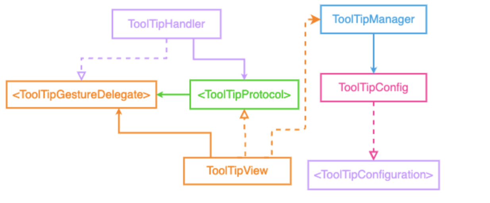
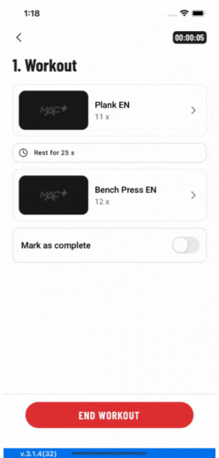
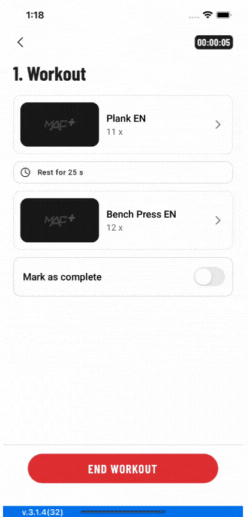
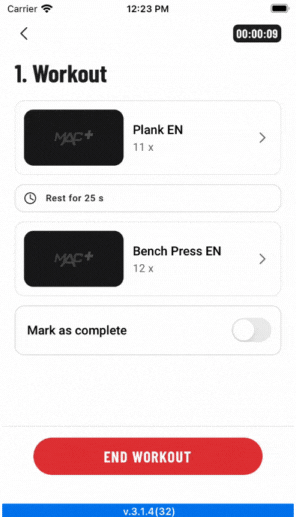

# ToolTipKit

Enhance the user experience by using a tooltip kit.

[ToolTipKit Docs](https://mobven.github.io/ToolTipKit/) describe how to integrate the framework.

## Dependency Graph [draw.io](https://drive.google.com/file/d/1bNvo1xb1lsaLDpgqNKl-IqLFSppN3k3L/view?usp=sharing)
<div align="center">
  
</div>

## Gifs

<div align="center">
  <span width="248" height="517">
    
    </span>
    <span width="248" height="517">
    
    </span>
    <span width="296" height="517">
    
   </span>
</div>

<div align="center">
<span width="248" height="22">

</span>
<span width="248" height="22">

</span>
<span width="296" height="22">

</span>
</div>

## Screenshots

<p align="center">
    
    
    
    
    
</p>


## Requirements
* iOS 11+
* Xcode 14+
* Swift 5.8+

## Installation

Currently ToolTipKit is only avaliable via SPM. You can also add manually to your project.

### SPM
If you have already Swift package set up, add `ToolTipKit` as a dependency to your dependencies in your `Package.swift` file.
```swift
dependencies: [
    .package(url: "https://github.com/mobven/ToolTipKit.git")
]
```

## Usage

### UIKit

This code initializes a ToolTipHandler object with a collection of tooltips and presents the tooltips. Each tooltip is associated with a specific view (repeatView, weightView, and infoView) and displays localized text ("repeat_tooltip", "weight_tooltip", and "info_tooltip"). The ToolTipHandler provides functionality for managing and displaying tooltips in the application.

```swift
let toolTips =  ToolTipHandler(toolTips: [
                    ToolTipView(
                        overView: repeatView,
                        text: "repeat_tooltip".localized
                    ),
                    ToolTipView(
                        overView: weightView,
                        text: "weight_tooltip".localized
                    ),
                    ToolTipView(
                        overView: infoView,
                        text: NSAttributedString(string: "something".localized)
                    )
            ])
toolTips.presentFirst()
```

#### Customization

You can easly customize the tooltip with editing `Configuration` properties.


| Property                     | Type           | Description                                                                        |
| ---------------------------- | -------------- | -----------------------------------------------------------------------------------|
| `textFont`                   | `UIFont`       | The font used for the tooltip text.                                                |
| `textColor`                  | `UIColor`      | The color of the tooltip text.                                                     |
| `shouldHighlightView`        | `Bool`         | A Boolean value that determines whether to highlight the view which shows tooltip. |
| `toolTipBacgroundColor`      | `UIColor`      | The background color of the tooltip view.                                          |
| `toolTipCornerRadius`        | `CGFloat`      | The corner radius of the tooltip view.                                             |
| `toolTipViewPadding`         | `CGFloat`      | The padding around the tooltip view.                                               |
| `triangleSize`               | `CGSize`       | The size of the triangle on the tooltip view.                                      |
| `toolTipLabelEdgeInsets`     | `UIEdgeInsets` | The edge insets of the tooltip label.                                              |
| `toolTipLeadingPadding`      | `CGFloat`      | The leading padding of the tooltip view.                                           |
| `toolTipTrailingPadding`     | `CGFloat`      | The trailing padding of the tooltip view.                                          |
| `tooltipSpacerConstant`      | `CGFloat`      | The constant used for the safe area between tooltip space.                         |
| `toolTipTextBacgroundColor`  | `UIColor`      | The background color of the tooltip text.                                          |

##### Example 
You can customize properties like this,

```swift
  ToolTipManager.shared.config.textColor = .gray
  ToolTipManager.shared.config.shouldHighlightView = true
```
or you can create your own `Config`

```swift
    let toolTipConfig= ToolTipConfig(
        textFont: .system,
        textColor: .black,
        shouldHighlightView: false,
        toolTipBacgroundColor: UIColor.black.withAlphaComponent(0.15),
        toolTipCornerRadius: 4.0,
        toolTipViewPadding: 6.0,
        triangleSize: CGSize(width: 10.0, height: 12.0),
        toolTipLabelEdgeInsets: UIEdgeInsets(top: 6.0, left: 8.0, bottom: 7.0, right: 8.0),
        toolTipLeadingPadding: 15,
        toolTipTrailingPadding: 26,
        toolTipTextBacgroundColor: .white
    )
    ToolTipManager.shared.config = toolTipConfig
```
  
---

# TooltipKitUI

A simple and customizable tooltip library for SwiftUI applications. TooltipKitUI allows you to easily add beautiful tooltips to any view with extensive customization options.

## Features

- 🎨 Highly customizable appearance
- 📱 iOS 14+
- ✨ Smooth animations
- 🎭 Highlight effect around target views
- 📐 Flexible arrow positioning (top/bottom)

## Installation

### Swift Package Manager

Add TooltipKitUI to your project using Swift Package Manager:

1. In Xcode, go to **File** → **Add Packages...**
2. Enter the repository URL
3. Select the version you want to use
4. Add the package to your target

## Quick Start

### 1. Wrap your content in `TooltipContainer`

```swift
import SwiftUI
import TooltipKitUI

struct ContentView: View {
    var body: some View {
        TooltipContainer {
            // Your app content here
        }
    }
}
```

### 2. Add tooltip to any view

```swift
struct ContentView: View {
    @State private var showTooltip = false
    
    var body: some View {
        TooltipContainer {
            Button("Show Tooltip") {
                showTooltip = true
            }
            .tooltip(
                isPresented: $showTooltip,
                title: "Welcome!",
                description: "This is a tooltip example"
            )
        }
    }
}
```

## Configuration Parameters

The `.tooltip()` modifier accepts the following parameters:

### Required Parameters

| Parameter | Type | Description |
|-----------|------|-------------|
| `isPresented` | `Binding<Bool>` | Controls tooltip visibility |
| `title` | `String` | Tooltip title text |
| `description` | `String` | Tooltip description text |

### Optional Parameters

#### Arrow & Layout

| Parameter | Type | Default | Description |
|-----------|------|---------|-------------|
| `arrowDirection` | `ArrowDirection` | `.top` | Arrow position (`.top` or `.bottom`) |
| `tooltipWidth` | `CGFloat` | `350` | Width of the tooltip |
| `spacing` | `CGFloat` | `16` | Spacing between title and description |
| `highlightCornerRadius` | `CGFloat` | `8` | Corner radius of the highlight effect |

#### Typography

| Parameter | Type | Default | Description |
|-----------|------|---------|-------------|
| `titleFont` | `Font` | `.system(size: 12)` | Font for the title |
| `descriptionFont` | `Font` | `.system(size: 12)` | Font for the description |
| `titleColor` | `Color` | `.black` | Color of the title text |
| `descriptionColor` | `Color` | `.gray` | Color of the description text |

#### Padding

| Parameter | Type | Default | Description |
|-----------|------|---------|-------------|
| `titlePadding` | `EdgeInsets` | `EdgeInsets(top: 16, leading: 16, bottom: 0, trailing: 16)` | Padding around the title |
| `descriptionPadding` | `EdgeInsets` | `EdgeInsets(top: 0, leading: 32, bottom: 32, trailing: 32)` | Padding around the description |

#### Appearance

| Parameter | Type | Default | Description |
|-----------|------|---------|-------------|
| `backgroundColor` | `Color` | `.white` | Background color of the tooltip |
| `shadowRadius` | `CGFloat` | `10` | Shadow radius around the tooltip |
| `cornerRadius` | `CGFloat` | `8` | Corner radius of the tooltip |

## Usage Examples

### Basic Tooltip

```swift
Button("Info") {
    showTooltip = true
}
.tooltip(
    isPresented: $showTooltip,
    title: "Information",
    description: "This button provides additional information"
)
```

### Customized Tooltip

```swift
Button("Custom Tooltip") {
    showTooltip = true
}
.tooltip(
    isPresented: $showTooltip,
    title: "Custom Style",
    description: "This tooltip has custom colors and fonts",
    arrowDirection: .bottom,
    titleFont: .system(size: 16, weight: .bold),
    descriptionFont: .system(size: 14),
    titleColor: .blue,
    descriptionColor: .secondary,
    tooltipWidth: 300,
    backgroundColor: .systemBackground,
    shadowRadius: 15
)
```

### Tooltip with Bottom Arrow

```swift
Image(systemName: "questionmark.circle")
    .tooltip(
        isPresented: $showTooltip,
        title: "Help",
        description: "Tap anywhere to dismiss",
        arrowDirection: .bottom
    )
```

## Dismissal

Tooltips are automatically dismissed when:
- User taps anywhere on the screen (outside or inside the tooltip)
- The `isPresented` binding is set to `false` programmatically

## Requirements

- iOS 14.0+ / macOS 11.0+
- Swift 5.0+
- Xcode 12.0+

## License

Copyright © 2025 Mobven. All rights reserved.

---
Developed with 🖤 at [Mobven](https://mobven.com/) for [MAC+](https://apps.apple.com/tr/app/mac-online-fitness-deneyimi/id1573778936/)
