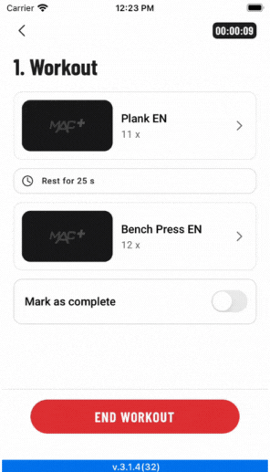
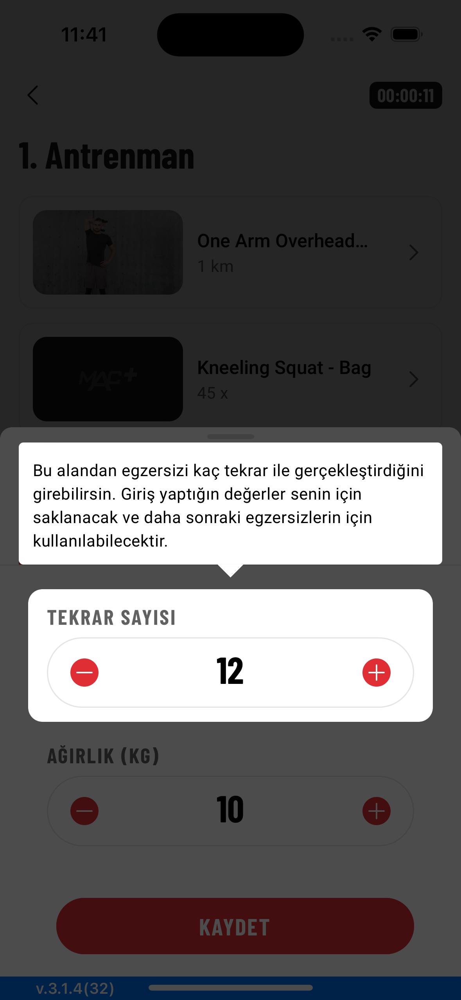
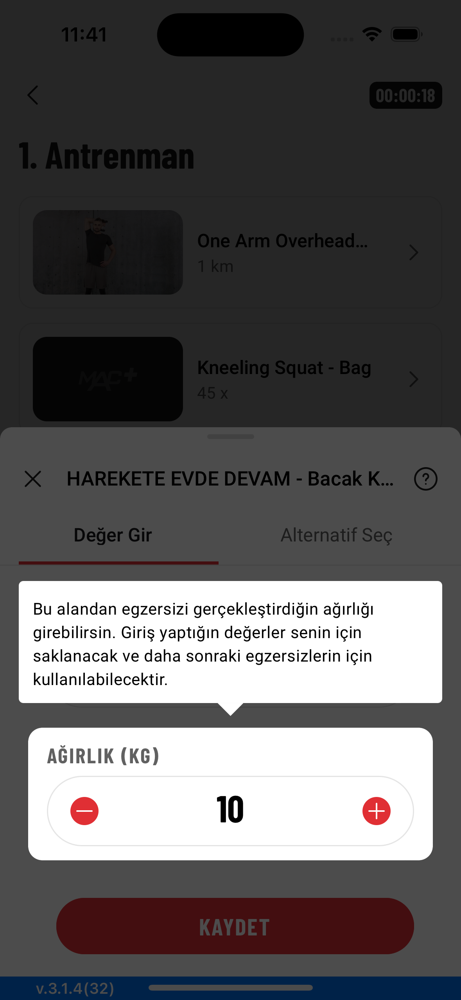
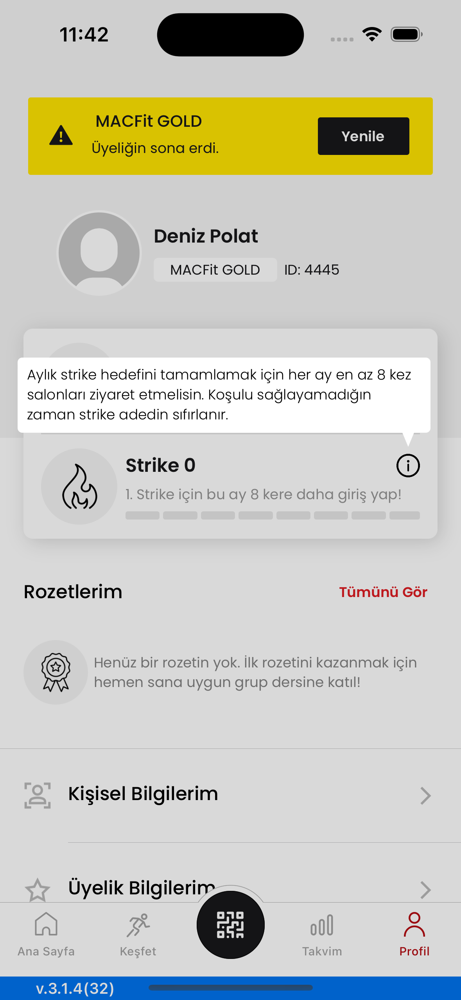
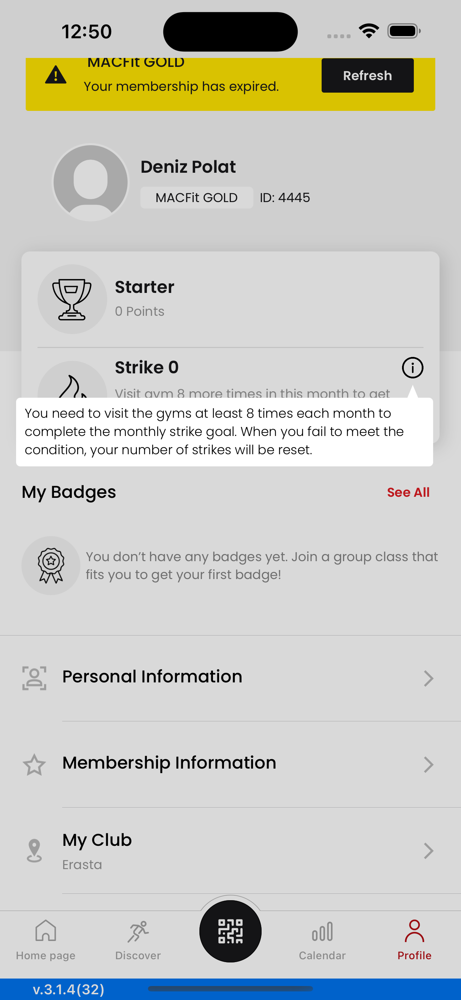

# ToolTipKit

Enhance the user experience by using a tooltip kit.

## Gifs

<div align="center">
  <span width="248" height="517">
    
    </span>
    <span width="248" height="517">
    
    </span>
    <span width="296" height="517">
    
   </span>
</div>

<div align="center">
<span width="248" height="22">

</span>
<span width="248" height="22">

</span>
<span width="296" height="22">

</span>
</div>

## Screenshots

<p align="center">
    
    
    
    
    
</p>


## Requirements
* iOS 11+
* Xcode 14+
* Swift 5.8+

## Installation

Currently ToolTipKit is only avaliable via SPM. You can also add manually to your project.

### SPM
If you have already Swift package set up, add `ToolTipKit` as a dependency to your dependencies in your `Package.swift` file.
```swift
dependencies: [
    .package(url: "https://github.com/mobven/ToolTipKit.git")
]
```

## Usage

### UIKit

This code initializes a ToolTipHandler object with a collection of tooltips and presents the tooltips. Each tooltip is associated with a specific view (repeatView, weightView, and infoView) and displays localized text ("repeat_tooltip", "weight_tooltip", and "info_tooltip"). The ToolTipHandler provides functionality for managing and displaying tooltips in the application.

```swift
let toolTips =  ToolTipHandler(toolTips: [
                    ToolTipView(
                        overView: repeatView,
                        text: "repeat_tooltip".localized
                    ),
                    ToolTipView(
                        overView: weightView,
                        text: "weight_tooltip".localized
                    ),
                    ToolTipView(
                        overView: infoView,
                        text: NSAttributedString(string: "something".localized)
                    )
            ])
toolTips.presentFirst()
```

#### Customization

You can easly customize the tooltip with editing `Configuration` properties.


| Property                 | Type           | Description                                                                        |
| ------------------------ | -------------- | -----------------------------------------------------------------------------------|
| `textFont`               | `UIFont`       | The font used for the tooltip text.                                                |
| `textColor`              | `UIColor`      | The color of the tooltip text.                                                     |
| `shouldHighlightView`    | `Bool`         | A Boolean value that determines whether to highlight the view which shows tooltip. |
| `toolTipBacgroundColor`  | `UIColor`      | The background color of the tooltip view.                                          |
| `toolTipCornerRadius`    | `CGFloat`      | The corner radius of the tooltip view.                                             |
| `toolTipViewPadding`     | `CGFloat`      | The padding around the tooltip view.                                               |
| `triangleSize`           | `CGSize`       | The size of the triangle on the tooltip view.                                      |
| `toolTipLabelEdgeInsets` | `UIEdgeInsets` | The edge insets of the tooltip label.                                              |
| `toolTipLeadingPadding`  | `CGFloat`      | The leading padding of the tooltip view.                                           |
| `toolTipTrailingPadding` | `CGFloat`      | The trailing padding of the tooltip view.                                          |
| `tooltipSpacerConstant`  | `CGFloat`      | The constant used for the safe area between tooltip space.                         |

##### Example 
You can customize properties like this,

```swift
  ToolTipManager.shared.config.textColor = .gray
  ToolTipManager.shared.config.shouldHighlightView = true
```
or you can create your own `Config`

```swift
    let toolTipConfig= ToolTipConfig(
        textFont: .system,
        textColor: .black,
        shouldHighlightView: false,
        toolTipBacgroundColor: UIColor.black.withAlphaComponent(0.15),
        toolTipCornerRadius: 4.0,
        toolTipViewPadding: 6.0,
        triangleSize: CGSize(width: 10.0, height: 12.0),
        toolTipLabelEdgeInsets: UIEdgeInsets(top: 6.0, left: 8.0, bottom: 7.0, right: 8.0),
        toolTipLeadingPadding: 15,
        toolTipTrailingPadding: 26
    )
    ToolTipManager.shared.config = toolTipConfig
```
---
Developed with 🖤 at [Mobven](https://mobven.com/)
