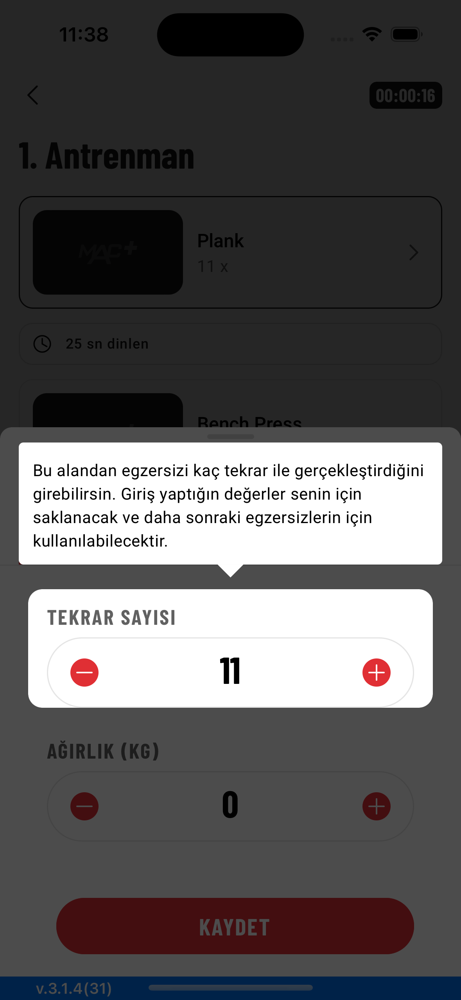

# ToolTipKit

A description of this package.

Enhance the user experience by using a tooltip kit.

## Screenshots

[](ScreenShots/iphoe14video.mp4)
[](ScreenShots/Screenshot - iPhone 14 Pro 1.png)
[](ScreenShots/Screenshot - iPhone 14 Pro 2.png)
[](ScreenShots/Screenshot - iPhone 14 Pro 3.png)
[](ScreenShots/Screenshot - iPhone 14 Pro 4.png)
[](ScreenShots/Screenshot - iPhone 14 Pro 4.png)
[](ScreenShots/Screenshot - iPhone 14 Pro 5.png)


## Requirements
* iOS 12+
* Xcode 14+
* Swift 5.8+

## Installation

Currently ToolTipKit is only avaliable via SPM. You can also add manually to your project.

### SPM
If you have already Swift package set up, add CountryPicker as a dependency to your dependencies in your `Package.swift` file.
```swift
dependencies: [
    .package(url: "https://github.com/mobven/ToopTipKit.git")
]
```

## Usage

### UIKit

This code initializes a ToolTipHandler object with a collection of tooltips and presents the tooltips. Each tooltip is associated with a specific view (repeatView, weightView, and infoView) and displays localized text ("repeat_tooltip", "weight_tooltip", and "info_tooltip"). The ToolTipHandler provides functionality for managing and displaying tooltips in the application.

```swift
let toolTips =  ToolTipHandler(toolTips: [
                    ToolTipView(
                        overView: repeatView,
                        text: "repeat_tooltip".localized
                    ),
                    ToolTipView(
                        overView: weightView,
                        text: "weight_tooltip".localized
                    ),
                    ToolTipView(
                        overView: infoView,
                        text: "info_tooltip".localized
                    )
            ])
toolTips.presentFirst()
```

#### CountryPickerDelegate

Delegate method will be called with country selection, you can update your outlets with new selected country model.

```swift
extension ViewController: CountryPickerDelegate {
    func countryPicker(didSelect country: Country) {
        countryTextField.text = country.isoCode.getFlag() + " " + country.localizedName
    }
}
```

#### Customization

You can easly customize the tooltip with editing `Configuration` properties.

```swift
public protocol ToolTipConfiguration {
    var textFont: UIFont { get set }
    var textColor: UIColor { get set }
    var isShowView: Bool { get set }
    var toolTipBacgroundColor: UIColor { get set }
    var toolTipCornerRadius: CGFloat { get set }
    var toolTipViewPadding: CGFloat { get set }
    var triangleSize: CGSize { get set }
    var toolTipLabelEdgeInsets: UIEdgeInsets { get set }
    var toolTipLeadingPadding: CGFloat { get set }
    var toolTipTrailingPadding: CGFloat { get set }
    var tooltipSpacerConstant: CGFloat { get set }
    var letterSpacingText: CGFloat { get set }
    var lineHeigtText: CGFloat { get set }
}
```
##### Example 
You can customize properties like this,

```swift
  ToolTipManager.shared.config.textColor = .gray
  ToolTipManager.shared.config.isShowView = true
```
or you can create your own `Config`

```swift
    let toolTipConfig= ToolTipConfig(
        textFont: .system,
        textColor: .black,
        isShowView: false,
        toolTipBacgroundColor: UIColor.black.withAlphaComponent(0.15),
        toolTipCornerRadius: 4.0,
        toolTipViewPadding: 6.0,
        triangleSize: CGSize(width: 10.0, height: 12.0),
        toolTipLabelEdgeInsets: UIEdgeInsets(top: 6.0, left: 8.0, bottom: 7.0, right: 8.0),
        toolTipLeadingPadding: 15,
        toolTipTrailingPadding: 26,
        letterSpacingText: .zero,
        lineHeigtText: 17
    )
    ToolTipManager.shared.config = toolTipConfig
```

## What's next
- [x] Sample Project.
- [x] SwiftUI representable code example.
  
---
Developed with 🖤 at [Mobven](https://mobven.com/)
